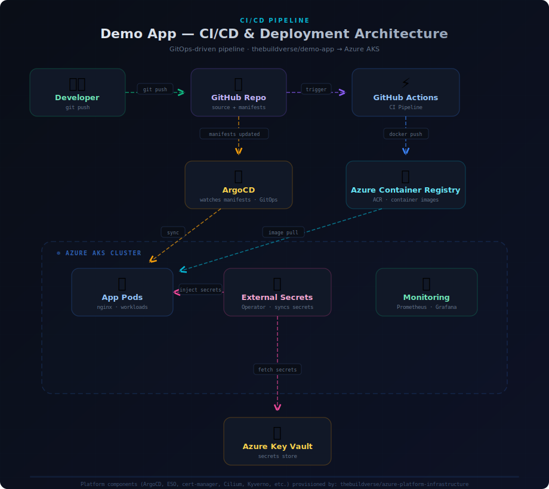

# Cloud Native Demo App

A GitOps-powered demo application deployed on **Azure AKS** via **ArgoCD**, with CI/CD through **GitHub Actions** and secrets managed by **External Secrets Operator** pulling from **Azure Key Vault**.

> **Part of a two-repo setup.** This repo contains the application, its Kubernetes manifests, and the CI/CD pipeline. The underlying AKS platform — including ArgoCD, cert-manager, ExternalDNS, Kyverno, and External Secrets Operator — is provisioned by [`thebuildverse/azure-platform-infrastructure`](https://github.com/thebuildverse/azure-platform-infrastructure). Deploy the infrastructure first, then come back here.


---

## Architecture




> An interactive version of this diagram is also available at [`https://bytiv.github.io/diagrams/pipeline-architecture.html`](https://bytiv.github.io/diagrams/pipeline-architecture.html).

---

## Project Structure

```
demo-app/
├── .github/
│   └── workflows/
│       └── ci-cd.yaml              # GitHub Actions CI/CD pipeline
├── src/                             # Application source code
│   ├── index.html
│   ├── css/
│   │   └── style.css
│   └── js/
│       └── app.js
├── k8s/
│   ├── base/                        # Kubernetes manifests (watched by ArgoCD)
│   │   ├── deployment.yaml
│   │   ├── service.yaml
│   │   ├── ingress.yaml
│   │   ├── namespace.yaml
│   │   ├── cilium-policy.yaml       # Network policy (commented out — see infra repo)
│   │   └── external-secret.yaml
│   └── argocd/
│       └── application.yaml         # ArgoCD Application CR
├── Dockerfile
├── docker-entrypoint.sh             # Injects secrets into HTML at runtime
├── nginx.conf                       # Custom nginx configuration
└── README.md
```

---

## How It Works

```
Developer pushes code ──▶ GitHub Actions builds image ──▶ Pushes to ACR
                                        │
                                        ▼
                              Updates k8s/base/deployment.yaml with new tag
                                        │
                                        ▼
                         ArgoCD detects manifest change ──▶ Syncs to AKS
                                                                │
                                                                ▼
                                                External Secrets Operator
                                                pulls secret from Key Vault
                                                        │
                                                        ▼
                                                  App displays the
                                                  secret on the page
```

1. **Push code** — any change to `src/`, `Dockerfile`, `nginx.conf`, or `docker-entrypoint.sh` triggers the pipeline.
2. **Build & Push** — GitHub Actions builds a multi-arch Docker image and pushes it to Azure Container Registry.
3. **Update Manifests** — the pipeline updates the image tag in `k8s/base/deployment.yaml` and commits back to the repo.
4. **ArgoCD Sync** — ArgoCD watches the `k8s/base/` directory and automatically deploys changes to the AKS cluster.
5. **Secrets** — External Secrets Operator syncs `secret-message` from Azure Key Vault into a Kubernetes secret, which is injected as an environment variable into the app at runtime.

---

## Prerequisites

This app is designed to run on the platform provisioned by [`azure-platform-infrastructure`](https://github.com/thebuildverse/azure-platform-infrastructure). You'll need:

- AKS cluster with ArgoCD, External Secrets Operator, cert-manager, NGINX Ingress Controller, and ExternalDNS — all deployed by the infrastructure repo
- Azure Container Registry (ACR) — also provisioned by the infrastructure repo
- A `ClusterSecretStore` pointing to Azure Key Vault (created by the infrastructure repo's ESO configuration)

If you haven't deployed the infrastructure yet, start there first.

---

## Setup

### Step 1: Configure GitHub Secrets

Go to your GitHub repo → **Settings** → **Secrets and variables** → **Actions**.

| Secret Name | Description | Example |
|-------------|-------------|---------|
| `ACR_NAME` | ACR name (without `.azurecr.io`) | `myacrregistry` |
| `ACR_USERNAME` | ACR admin username or service principal client ID | `myacrregistry` |
| `ACR_PASSWORD` | ACR admin password or service principal secret | `xxxxxxxx-xxxx-xxxx` |

> **Tip:** Find ACR credentials in the Azure Portal under your Container Registry → **Access keys** (enable Admin user), or use a service principal for production.

### Step 2: Create the Azure Key Vault Secret

This app demonstrates External Secrets Operator pulling a secret from Key Vault and displaying it on the page.

```bash
az keyvault secret set \
  --vault-name <YOUR_KEYVAULT_NAME> \
  --name "secret-message" \
  --value "Hello from Azure Key Vault!"
```

The value can be anything — it will appear in the app's **Vault Secret** section.

### Step 3: Configure the External Secret

Edit `k8s/base/external-secret.yaml` if your setup differs from the defaults:

```yaml
spec:
  secretStoreRef:
    name: azure-keyvault          # Must match your ClusterSecretStore name
    kind: ClusterSecretStore
  data:
    - secretKey: SECRET_MESSAGE
      remoteRef:
        key: secret-message        # Must match the Key Vault secret name
```

The flow from Key Vault to browser:

| Step | Component | What Happens |
|------|-----------|--------------|
| 1 | Azure Key Vault | Stores the secret `secret-message` |
| 2 | ExternalSecret CR | Tells ESO to pull `secret-message` from Key Vault |
| 3 | ESO | Creates a Kubernetes Secret called `demo-app-secret` |
| 4 | Deployment | Mounts all keys from `demo-app-secret` as env vars via `envFrom` |
| 5 | `docker-entrypoint.sh` | Reads `SECRET_MESSAGE` env var and injects it into the HTML |
| 6 | Browser | Displays the secret on the page |

### Step 4: Update Manifests for Your Environment

**`k8s/base/deployment.yaml`** — update the initial image (GitHub Actions manages this after the first run):
```yaml
image: <YOUR_ACR_NAME>.azurecr.io/demo-app:1
```

**`k8s/base/ingress.yaml`** — update the hostname:
```yaml
rules:
  - host: demo-app.yourdomain.com
tls:
  - hosts:
      - demo-app.yourdomain.com
```

**`k8s/argocd/application.yaml`** — update the repo URL:
```yaml
source:
  repoURL: https://github.com/<YOUR_ORG>/demo-app.git
destination:
  namespace: apps-demo-app
```

### Step 5: Deploy the ArgoCD Application

```bash
kubectl apply -f k8s/argocd/application.yaml
```

ArgoCD will now watch the `k8s/base/` directory and auto-sync any changes.

### Step 6: Push Code & Watch It Deploy

```bash
git add .
git commit -m "initial commit"
git push origin main
```

GitHub Actions builds the image, pushes to ACR, updates the deployment manifest, and ArgoCD picks it up and deploys to the cluster.

---

## Local Development

```bash
docker build -t demo-app .
docker run -p 8080:80 -e SECRET_MESSAGE="Hello from local dev!" demo-app
# Visit http://localhost:8080
```

---

## Customization

- **Change the domain** — edit `k8s/base/ingress.yaml`
- **Change replicas** — edit `k8s/base/deployment.yaml`
- **Add more secrets** — add entries to `external-secret.yaml` and reference them in the deployment's `envFrom`
- **Change the app** — edit files in `src/` and push; the pipeline handles everything else

---

## Related Repository

| Repo | Description |
|------|-------------|
| [`thebuildverse/azure-platform-infrastructure`](https://github.com/thebuildverse/azure-platform-infrastructure) | Terraform-managed AKS platform with all cluster tooling — deploy this first |
